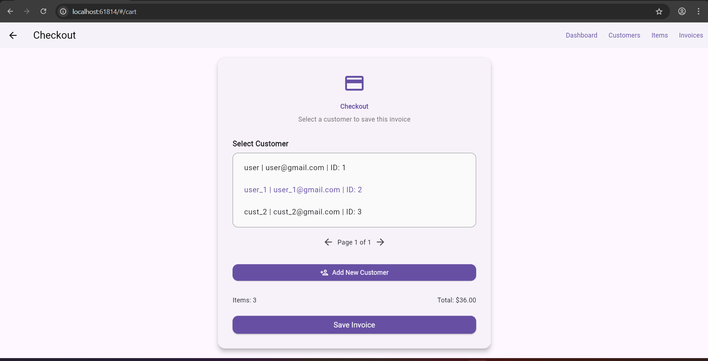
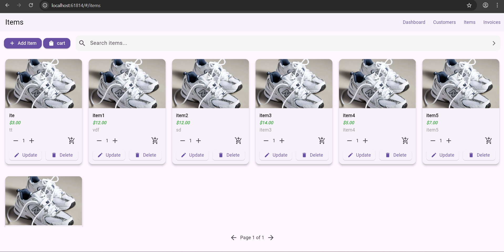

**Project:** 

Full Stack E_commerce_Apliman 

--- 

## Repo structure (expected)
/E_commerce_Apliman
  /backend            # Spring Boot project
  /frontend           # Flutter project


## 1) Database setup (MySQL) 

CREATE DATABASE ecommerce_apliman_db; 

## 2) Backend (Spring Boot) — run locally From the /backend folder:

````
./mvnw clean package
./mvnw spring-boot:run
````

will automatically create your data base tables 
The API should be reachable at http://localhost:8080/ 

## 3) Frontend (Flutter) — run locally ### Run the app From the /frontend folder:

````
flutter packages pub run build_runner build
flutter pub get
flutter run -d chrome
````

--- 

## 4) API endpoints 

checklist for more details go to : backend/src/main/java/controller/documentation 

* GET /customers?page=0&size=10 — get all customers (paged) 

* GET /customers/{id} 

* GET /customers/search?name=... 

* POST /customers 

* PUT /customers/{id} 

* DELETE /customers/{id} 

* GET /items?page=0&size=10 

* GET /items/{id} 

* GET /items/search?name=... 

* POST /items 

* PUT /items/{id} 

* DELETE /items/{id} 

* GET /invoices?page=0&size=10 

* GET /invoices/customer_id/{id} 

* GET /invoices/customer_name/{customer_name} 

* GET /invoices/{id} 

* GET /invoices/customer/{customerId} 

* PUT /invoices/{id} 

* POST /invoices — single endpoint to create invoice + items (transactional) 

* DELETE /invoices/{id} 

* GET /categories 

* GET /categories/{id} 

* POST /categories ---

## 5) Demo






// demo/... 